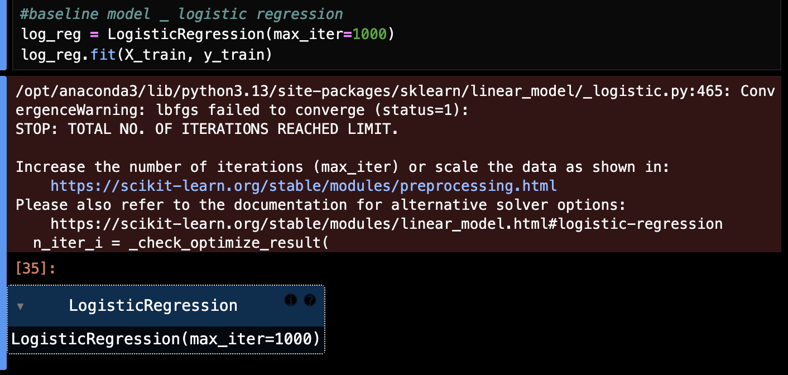
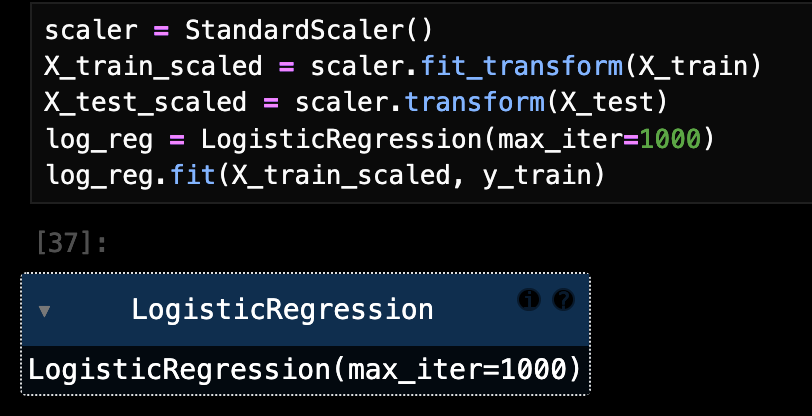

# Error and Warning Log

## 2026-04-18 ConvergenceWarning: lbfgs failed to converge

原因1:特征尺度差异较大
逻辑回归对特征尺度比较敏感，如果有些列数值很小，有些列数值很大，优化会变得更困难
原因2:1000次迭代对这个数据还不够
对这个数据集来说，可能1000次迭代还是不够

solution:先对X做标准化，再重新训练Logistic Regression
把不同特征拉到更接近的尺度，模型更容易收敛
对训练集和测试集特征进行标准化

